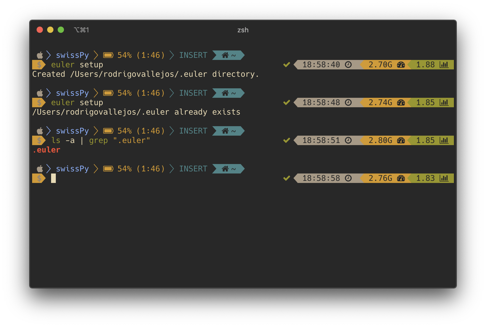
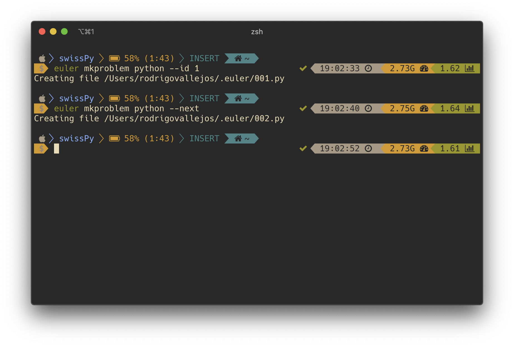
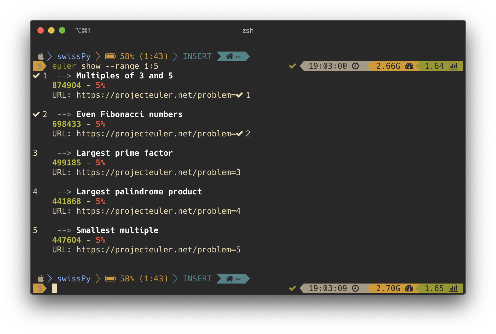
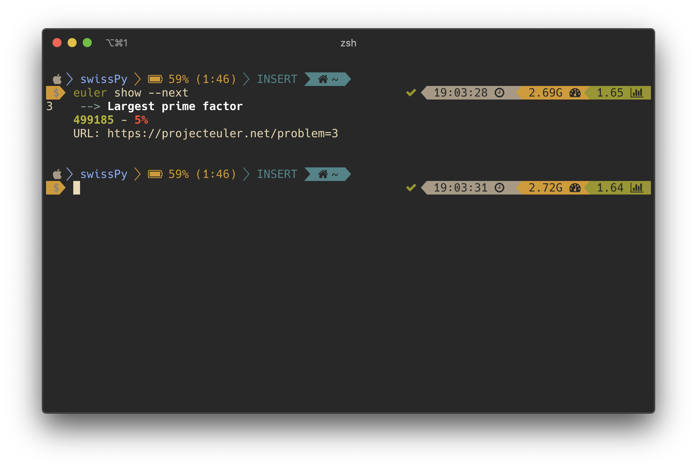
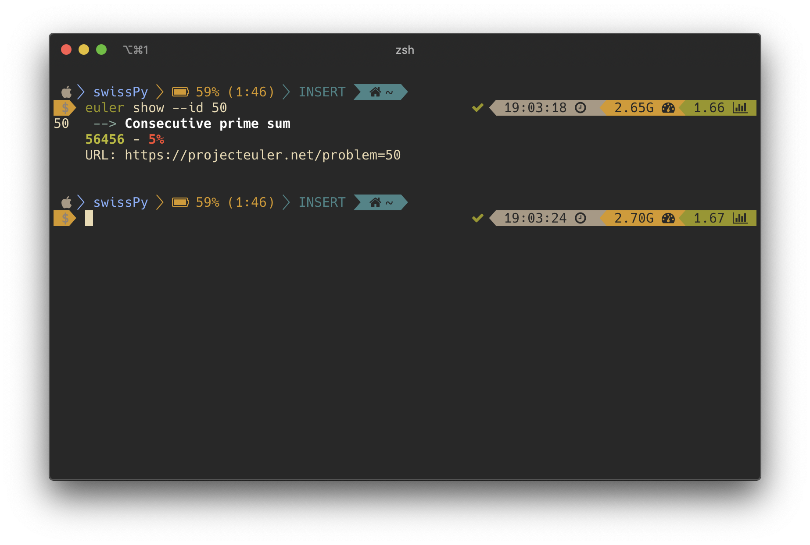
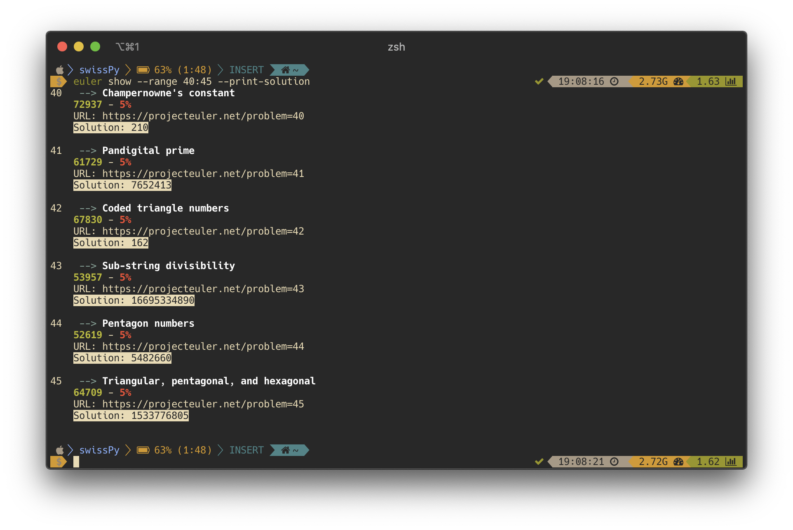
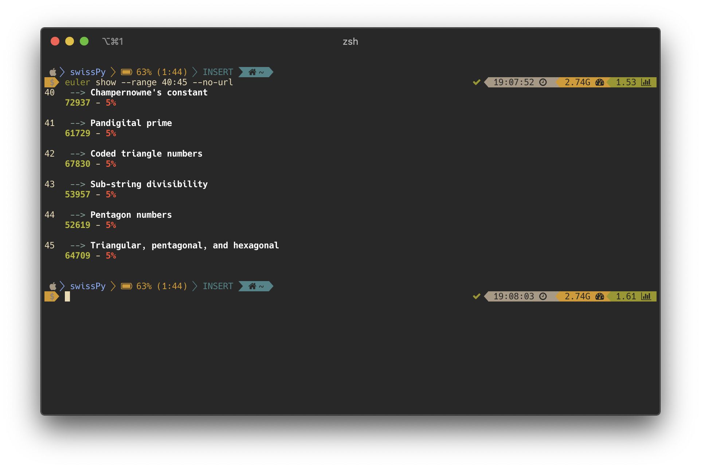
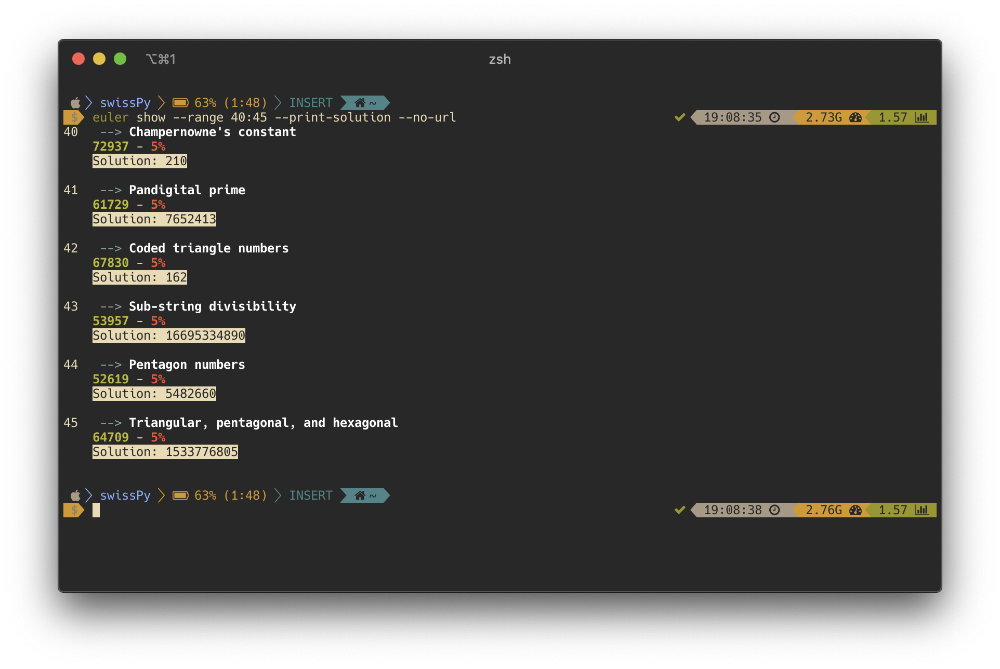

# swissPy: Project Euler CLI

## Manual

### `$ euler setup`

The `setup` command will create a `.euler` directory in your home directory. This will be where all probelms will be saved.

### `$ euler mkproblem`

You can make a problem file by calling on the `mkproblem` command. You must specify your programming language of choice. Files are named by a 3 padded numeric string, representing the the problem ID (ex. 1 --> 001) and suffixed by the respective programming langauge extension.

#### `-n` or `--next`

The `next` flag will create a file for the next problem, relative to the largest number in the `.euler` directory. Therefore, if you have files `001.py` and `050.py`, the next problem to be created would be `051.py`.

#### `-i` or `--id`

The `id` option will allow you to create a problem for a given problem ID.

### `$ euler show`

The `show` command will allow you to view available Project Euler problems. In order to use it you can use some of the following options. 

#### `-r` or `--range`

The `range` option allows you to specify which subset of problems you would like to view. For example, if you would like to see problems 1 through 5, you would run the following:

#### `-n` or `--next`

The `next` flag will show you the next problem that is available. Currently, this is done relative the largest numeric value in your `.euler` directory. Look at `mkproblem` for more detail.

#### `-i` or `--id`

The `id` option allows you to view a problem given its numeric ID. If you want to see problem 501, you can run the following:

#### `-s` or `--print-solution`

If you want to view the solution of the problems being shown, you can pass the `print-solution` flag.

#### `--no-url`

If you do not want to view the URL of a problem, you can pass the `no-url` flag.

#### `--print-solution` and `--no-url`

### TODO: `$ euler test`

### TODO: `$ euler submit`